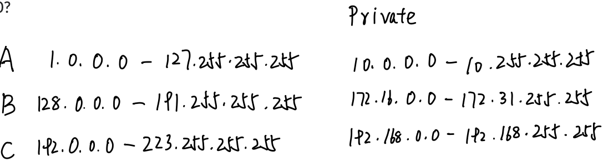
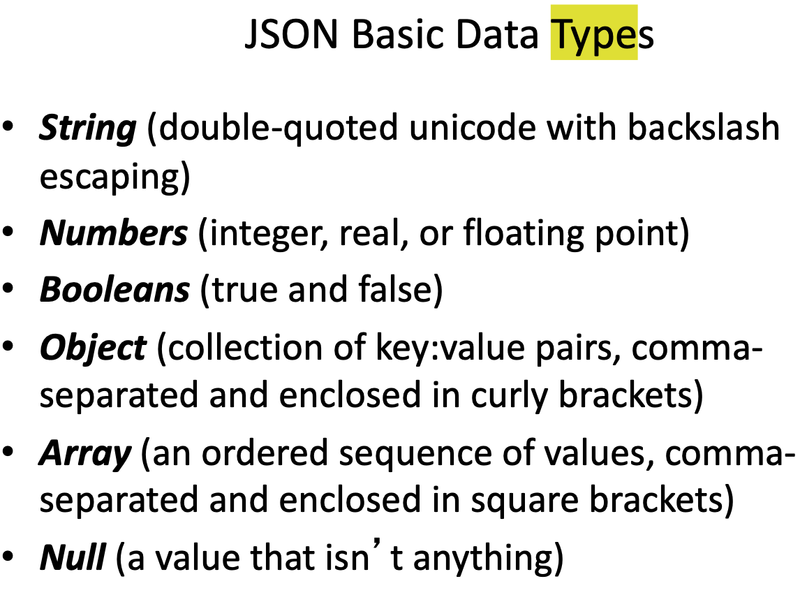
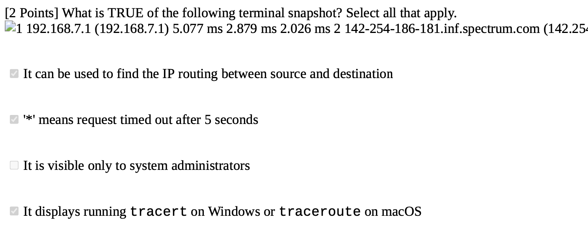

### CSS

Consider the following example from w3schools.com.

```HTML
Consider the following example from w3schools.com.
<!DOCTYPE html>
<html>
<head>
<style>
div {
width: 100px;
height: 100px;
background-color: red;
animation-name: example;
animation-duration: 4s;
}
@keyframes example {
from {background-color: red;}
to {background-color: yellow;}
}
</style>
</head>
<body>
<h1>CSS Animation</h1>
<div></div>
</body>
</html>

```

What happens when the animation is finished? 

✅true: It goes back to the original style

✅true: Square is red

#### Default Behavior:

- The animation does **not** persist the final state (`background-color: yellow`).
- By default, the styles revert to the original state (`background-color: red`) after the animation ends.


### Networking

IP address:




TCP is A connection-oriented protocol


### HTML DOM

Tim Berners-Lee invented: Hyperlinking

How many heading tags are there in HTML? 6: h1-h6


### JSON

✅true: Both JSON and XML can be fetched with an `XMLHttpRequest`

✅true: Both JSON and XML can be parsed and used by lots of programming

languages

❌false: Both can be parsed by a standard JavaScript function

❌false: Both can be parsed by an XML parser

❌false: False: JavaScript has a built in function for converting an XML object into a JSON string

✅true: JavaScript has a built in function for converting JSON strings into JavaScript objects

✅true: JavaScript has a built in function for converting a JavaScript object into a JSON string

✅true: The JSON format is syntactically similar to the code for creating JavaScript objects

✅true: JSON names require double quotes.

✅true: JSON is shorter than XML

✅true: XML is much more difficult to parse than JSON.

✅true: JSON is parsed into a ready-to-use JavaScript object.

✅true: JSON doesn't use end tags. but this doesn't make JSON better than XML

JSON is A data format, not document format.

Both JSON and XML are "**self describing**" (**human readable**)

✅true: XML is much more difficult to parse than JSON.




Undefined 是 JS里的


The <script> tag with a src attribute does not have cross-domain restrictions in the same way as `XMLHttpRequest` or `fetch()`. This is because of a mechanism called CORS (Cross-Origin Resource Sharing) which affects AJAX requests but not **script loading**.


### HTTP

1. The client (browser) sends the "Accept-Encoding" header.

2. The "keep-alive" feature / HTTP header is the same as "persistent

connections."

3. What is the major difference between HTTP/1.1 and HTTP/2? **Header Compression**

4. What is a big difference between HTTP/1 and HTTP/1.1?

   'HTTP 1.1 uses less memory

    HTTP 1.1 enables persistent connections ✅TRUE

   'HTTP 1.1 is faster

   'HTTP 1.1 is a W3C commendation

4. What headers are used in Basic authentication? **Authorization** and **WWW-Authenticate**

5. Where are proxy servers utilized?

   Both, at the client and server sides.

6. valid values of the Accept-Encoding header:

   ```html
   Accept-Encoding: gzip
   Accept-Encoding: compress
   Accept-Encoding: deflate
   Accept-Encoding: br
   Accept-Encoding: zstd
   Accept-Encoding: identity
   Accept-Encoding: *
   /* zlib 不是！！*/
   
   ```

7. How does a server send the type of the information it is providing to the browser?  **MIME media type** a n d **Content-Type header**

   `Content-Type: <MIME-type>`

   * Example:

   `Content-Type: text/html`

   * *Some important MIME types are*

     – text/plain, text/html

     – image/gif, image/jpeg

     – audio/basic, audio/wav, audio/x-pn-realaudio

     – model/vrml

     – video/mpeg, video/quicktime, video/vnd.rn-realmedia, video/x-ms-wmv

     – application/*, application-specific data that does not fall under any other MIME category, e.g. application/vnd.ms-powerpoin

8. Strict-Transport-Security (HSTS)
   Force communication using HTTPS instead of HTTP.

9. Cache-Control
   Directives for caching mechanisms in both requests and responses.

10. X-Frame-Options (XFO)
    Indicates whether a browser should be allowed to render a page in a <frame>, <iframe>, <embed> or <object>.

11. properties of ETags:

    - Used in cache validation
    - Similar to fingerprints
    - allows a client to make conditional requests
    - caches use the **If-None-Match** condition header to get a new copy if the entity tag has changed
    - if the tags match, then a **304 Not Modified** is returned

13. header that is used to improve cache performance

    1. [`Age`](https://developer.mozilla.org/en-US/docs/Web/HTTP/Headers/Age)
    2. [`Cache-Control`](https://developer.mozilla.org/en-US/docs/Web/HTTP/Headers/Cache-Control): Directives for caching mechanisms in both requests and responses.
    3. [`Clear-Site-Data`](https://developer.mozilla.org/en-US/docs/Web/HTTP/Headers/Clear-Site-Data)
    4. [`Expires`](https://developer.mozilla.org/en-US/docs/Web/HTTP/Headers/Expires): The date/time after which the response is considered stale.
    5. `ETag`
    6. `Last-Modified`

13. The server sends the "Content-Encoding" header.

14. What are required components of a web URL?

    protocol, host

    When using Universal Resource Identifiers (URIs) in HTML to reference other HTML pages at different web sites, what are the required components of the URIs? Please select all that apply.

    scheme / protocol 	e.g. http

    host name 	e.g. Baidu.com

15. 

16. A port is in the range from 0 to 65535 (16 bits)

    – **0-1023** (inclusively) are **reserved** for well-known applications, so root or administrator access is required to run a program on a port in that range

    – **1024-49151** (inclusively) are registered ports and can be used by any application

    – **49152-65535** are dynamic or private ports and are typically used by the operating system when an application needs to pass an application off to a non-

    registered port

17. Who decides when to use compression in an HTTP transaction? server and client

18. The "**keep-alive**" feature / HTTP header is the same as "**persistent connections**."

19. What is TRUE of DHCP (Dynamic Host Control Protocol)? Select all that apply.

    ✅TRUE Automatically assigns private IP addresses when a device joins a network

    ❌FALSE Cannot assign other network configuration, other than IP addresses

    ✅TRUE It is normally built into a router

    ✅TRUE Can assign both private and public IP addresses


### DOM

1. ✅ The DOM is a programming interface (TRUE)

2. What is the purpose of the IFRAME element? **embed a site**

3. ✅ The DOM is language independent

4. ✅ The DOM represents an HTML file as a tree

5. ✅ The DOM is OS independent

   


### Python

1.  set is a collection which is unchangeable, where set items are unchangeable, but you can remove items and add new items

2. tuple allows duplicates

3. Global variables should use only uppercase letters. - false

   it is just a convention

4. Constants are **NOT** part of the Python specification

5. Python runs on an interpreter system. This means that prototyping can be very quick.


JSON的key如果是string必须要加引号，但是js的object不一定需要。

python的dictionary的key如果是string也必须要加引号


### Javascript 

[JSON.stringify() will remove any functions from an object.](https://www.w3schools.com/js/tryit.asp?filename=tryjson_stringify_function)

[Adding elements with high indexes can create undefined "holes" in an array.](https://www.w3schools.com/js/tryit.asp?filename=tryjs_array_holes)

Q: Select all the JavaScript statements that are syntactically correct.

```
var multipleValues = [ ];
var multipleValues = new Array();
var multipleValues = Array();
var multipleValues = Array(5);
```

| **Statement**                     | **Valid?** | **Description**                                              |
| --------------------------------- | ---------- | ------------------------------------------------------------ |
| var multipleValues = [ ];         | ✅ Yes      | Creates an **empty array** using array literal syntax (preferred way). |
| var multipleValues = new Array(); | ✅ Yes      | Creates an **empty array** using constructor syntax.         |
| var multipleValues = Array();     | ✅ Yes      | Also creates an **empty array** — Array can be used as a function without new. |
| var multipleValues = Array(5);    | ✅ Yes      | Creates an array of length 5 with **empty slots** (not filled with values). |

> ⚠️ Note: Array(5) creates an array with a length of 5 but no defined elements — it’s **not the same as** [5].